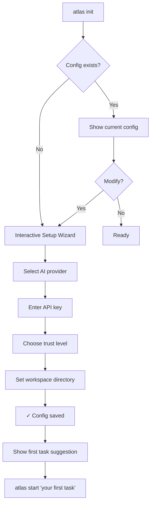
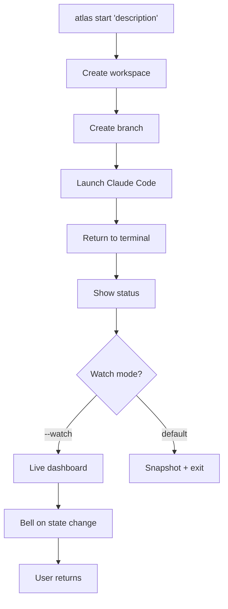
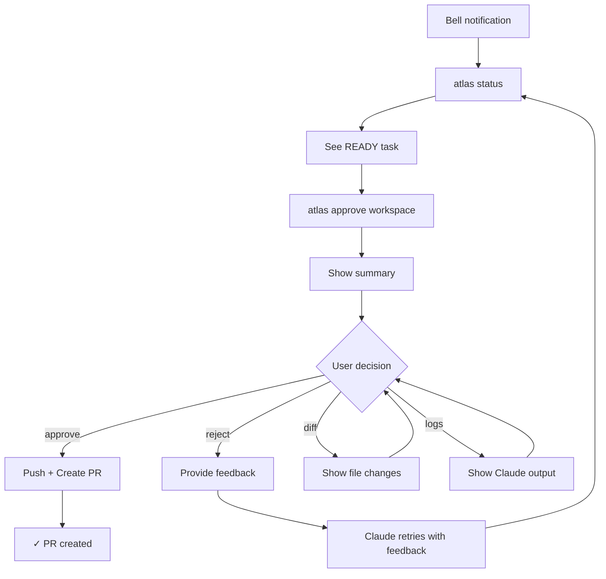
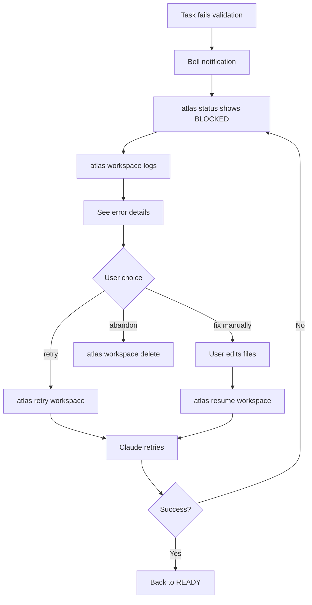

# UX Design Specification atlas

**Author:** MrZ
**Date:** 2025-12-27

---

## Executive Summary

### Project Vision

ATLAS transforms Go developers from executors into orchestrators. The TUI must embody this shift—showing developers their "fleet" of parallel workspaces, surfacing what needs attention, and making approval/rejection flows feel effortless. The goal is a CLI so polished that developers leave `atlas status --watch` running just because it's beautiful to look at.

### Target Users

**Primary: The Multi-Repo Maintainer**
- Senior Go developer, CLI-native, maintains 50+ repositories
- Comfortable with terminal tools, expects professional-grade UX
- Runs 3-5 parallel tasks, needs at-a-glance status awareness
- Values: Speed, clarity, minimal interruption, beautiful tooling

**Secondary: The Scale Developer**
- Enterprise Go developer on large codebases
- More cautious, prefers more checkpoints initially
- Values: Safety, transparency, clear error recovery

### Key Design Challenges

1. **Multi-Workspace Dashboard** - Show 3-5 parallel workspaces without cognitive overload
2. **Notification-Driven Flow** - Terminal bell + clear "ACTION" indicators replace polling
3. **Error Recovery UX** - Interactive menus for retry/fix/abandon must be intuitive
4. **Trust & Safety** - UX must feel reversible and transparent, especially for new users
5. **Progressive Disclosure** - Dense information, simple presentation, detail on demand

### Design Opportunities

1. **Reference-Quality TUI** - Leverage Charm ecosystem to set the standard for Go CLI beauty
2. **Live Dashboard Experience** - `atlas status --watch` as an addictive monitoring experience
3. **Delightful Micro-Interactions** - Approval flows, spinners, progress that feel premium
4. **Consistent Visual Language** - Iconography and color that creates instant recognition

## Core User Experience

### Defining Experience

The core ATLAS experience is **orchestration awareness** — knowing the state of your parallel workspaces at a glance and being summoned when decisions are needed. Users should feel like fleet commanders, not assembly line workers.

The primary interaction loop:
1. **Start** tasks with minimal input
2. **Monitor** via the status dashboard (or don't — get pinged)
3. **Decide** when ATLAS surfaces something requiring judgment
4. **Review** completed PRs and merge

### Platform Strategy

| Aspect | Decision |
|--------|----------|
| **Platform** | Terminal/CLI (macOS primary) |
| **Input** | Keyboard-driven, arrow keys + enter for menus |
| **Terminal Width** | Functional at 80 cols, beautiful at 120+ |
| **Color Support** | Full 256-color with NO_COLOR fallback |
| **Session** | On-demand execution, no daemon |
| **Integration** | Works in tmux, iTerm2, Terminal.app, VS Code terminal |

### Effortless Interactions

| Interaction | Design Goal |
|-------------|-------------|
| Starting a task | One command, smart defaults, minimal required flags |
| Checking status | Instant table render, `--watch` for live updates |
| Knowing what to do | ACTION column shows exact command to run |
| Error recovery | Interactive menu with clear options, no command memorization |
| Parallel monitoring | 5 workspaces visible without scrolling |

### Critical Success Moments

1. **First Task Victory** — User sees their first AI-generated PR and thinks "this actually works"
2. **The Productivity Leap** — Morning GitHub shows 3 clean PRs waiting without babysitting
3. **Graceful Failure** — Error recovery flow that feels helpful, not frustrating
4. **Dashboard Addiction** — `atlas status --watch` becomes a permanent terminal tab

### Experience Principles

| Principle | Meaning |
|-----------|---------|
| **Glanceable > Complete** | 3-second status comprehension. Details on demand. |
| **Action-Oriented** | Every state shows the next step. Never "what now?" |
| **Notification-Driven** | ATLAS summons you. You don't poll it. |
| **Trust Through Transparency** | Show diffs, files, logs. No black boxes. |
| **Error Recovery is UX** | Failures are features. Recovery should be delightful. |

## Desired Emotional Response

### Primary Emotional Goals

**Core Emotion: Empowerment**
Users should feel transformed from "grunt doing repetitive work" to "commander orchestrating a fleet." ATLAS elevates the developer's role.

**Supporting Emotions:**
- **Confidence** — "ATLAS will handle this correctly"
- **Calm Control** — "I can see everything, nothing is hidden"
- **Delight** — "This is actually satisfying to use"
- **Accomplishment** — "Look at what I achieved today"

### Emotional Journey Mapping

| Stage | Emotion Arc | Design Response |
|-------|-------------|-----------------|
| First Discovery | Intrigued → Impressed | Professional polish, instant credibility |
| First Task | Nervous → Confident | Clear feedback, visible progress |
| Daily Use | Calm, In Flow | Minimal friction, smart defaults |
| Error State | Concerned → Reassured | Clear recovery options, no panic |
| Task Complete | Satisfied → Proud | Celebrate the win, show the impact |
| Returning | Eager, Ready | Remember state, quick context recovery |

### Micro-Emotions

**Cultivate:**
| Emotion | How |
|---------|-----|
| Trust | Transparent state files, visible logs, no black boxes |
| Competence | Clear explanations, user understands what's happening |
| Accomplishment | Every completion feels like a win |
| Satisfaction | Dashboard is genuinely pleasant to look at |

**Prevent:**
| Emotion | How to Avoid |
|---------|--------------|
| Anxiety | Always show what's happening, never "thinking..." with no context |
| Confusion | Clear next steps, ACTION column, copy-paste commands |
| Frustration | Actionable error messages, recovery is part of the flow |
| Impatience | Progress indication, step counts, spinners with purpose |

### Design Implications

| Emotion | UX Approach |
|---------|-------------|
| Empowerment | Fleet view — user sees all workspaces as their domain |
| Trust | Transparency — JSON files, logs, diffs all accessible |
| Calm | Clean hierarchy — no visual noise, clear information structure |
| Delight | Polish — smooth transitions, satisfying spinners, attention to detail |
| Confidence | Clarity — explicit next steps, no guessing required |
| Accomplishment | Celebration — summary of achievement when tasks complete |

### Emotional Design Principles

1. **Professional, Not Playful** — Power tool aesthetic. Polished, not cute. Luxury car dashboard.
2. **Calm Confidence** — Neutral colors for progress, attention colors only when warranted.
3. **Reward Progress** — Every state change feels like forward momentum.
4. **Respect Intelligence** — Trust the user. Depth on demand, not by default.
5. **Make Waiting Beautiful** — If users wait, make it satisfying to watch.

## UX Pattern Analysis & Inspiration

### Inspiring Products Analysis

#### Claude Code
AI coding assistant — shows work in progress, streaming output, clear tool invocations.
**Key lesson:** Transparency builds trust. Show what's happening.

#### lazygit
Git TUI — information-dense dashboard, keyboard-first, semantic colors.
**Key lesson:** Density works when hierarchy is clear.

#### GitHub CLI (gh)
Structured CLI — consistent output patterns, actionable messages, progressive disclosure.
**Key lesson:** Consistency breeds confidence.

#### htop/btop
System monitors — real-time updates, visual hierarchy, addictive dashboards.
**Key lesson:** Live data can be beautiful.

#### Charm Ecosystem
Modern Go CLI aesthetic — polish, accessibility, composable components.
**Key lesson:** Every pixel matters.

### Transferable UX Patterns

| Category | Pattern | Source | ATLAS Application |
|----------|---------|--------|-------------------|
| Navigation | Keyboard-first | lazygit | Arrow keys + enter for menus |
| Navigation | `?` for help | lazygit/vim | Contextual action hints |
| Interaction | Streaming output | Claude Code | Show AI progress live |
| Interaction | Copy-paste commands | gh CLI | ACTION column with exact command |
| Interaction | Interactive selection | gh CLI (huh) | Approval/rejection menus |
| Visual | Semantic colors | lazygit | State-based color coding |
| Visual | Status icons | gh CLI | ● ✓ ⚠ ✗ iconography |
| Visual | Information density | htop | Multi-workspace single view |

### Anti-Patterns to Avoid

| Anti-Pattern | Problem | ATLAS Solution |
|--------------|---------|----------------|
| Wall of text | Overwhelming | Structured tables, clear hierarchy |
| Silent waiting | Anxiety | Always show progress |
| Cryptic errors | User stuck | Actionable messages + recovery menu |
| Inconsistent styling | Unprofessional | One visual language |
| Requiring memorization | Friction | Show next action explicitly |
| Deep modal states | User trapped | Clear escape routes |

### Design Inspiration Strategy

**Adopt:** lazygit keyboard model, gh CLI icons, Claude Code streaming, Charm components
**Adapt:** htop density (simplified), lazygit panes (single view table)
**Avoid:** Complex modes, deep nesting, scroll-required output, decorative colors

## Design System Foundation

### Design System Choice

**Framework:** Charm Ecosystem (Bubble Tea + Lip Gloss + Huh + Bubbles)

The Charm ecosystem is the industry standard for beautiful Go terminal applications. It provides:
- Bubble Tea: Elm-architecture TUI framework
- Lip Gloss: CSS-like terminal styling
- Bubbles: Pre-built components (tables, spinners, progress)
- Huh: Interactive form components

### Color Palette

| Role | Color | Usage |
|------|-------|-------|
| Primary (Blue) | `#00BFFF` | Running states, interactive elements |
| Success (Green) | `#00FF7F` | Completed, passing, approved |
| Warning (Yellow) | `#FFD700` | Needs attention, awaiting action |
| Error (Red) | `#FF4444` | Failed, rejected, errors |
| Muted (Gray) | `#888888` | Disabled, secondary, historical |

### State Iconography

| State | Icon | Color |
|-------|------|-------|
| Running | ● | Blue |
| Awaiting Approval | ✓ | Green |
| Needs Attention | ⚠ | Yellow |
| Failed | ✗ | Red |
| Completed | ✓ | Dim |
| Pending | ○ | Gray |

### Typography

- Monospace only (terminal constraint)
- Bold for headers and emphasis
- Dim for secondary information
- No italics (poor terminal support)

### Component Library

| Component | Source | Usage |
|-----------|--------|-------|
| Status Table | Bubbles | `atlas status` main view |
| Interactive Menu | Huh | Approval/rejection flows |
| Text Input | Huh | Feedback, naming |
| Spinner | Bubbles | Long operations |
| Progress | Bubbles | Step progress display |
| Multi-step Form | Huh | `atlas init` wizard |

### Implementation Phases

1. **Core:** Status table, spinners, confirmations
2. **Interactive:** Huh menus, wizard forms, error recovery
3. **Polish:** Animations, live updates, terminal bell

## Defining Experience

### The Signature Interaction

**"See your fleet at a glance, act when summoned"**

`atlas status` is ATLAS's defining experience. It transforms developers from task executors into fleet commanders. The moment users look at their status table and see 3 parallel workspaces — that's when the paradigm shift clicks.

### User Mental Model

**Current workflow (without ATLAS):**
- Run AI manually per repo
- Execute lint → test → commit → push → PR ceremonies
- Context-switch between repos
- Poll for CI status in browser

**Expected ATLAS experience:**
- Queue tasks, ATLAS handles execution
- Get notified when decisions needed
- Review and approve completed work
- Feel like a commander, not a grunt

### Success Criteria

| Criterion | Target |
|-----------|--------|
| Comprehension time | Under 3 seconds to understand state |
| Command memorization | Zero — ACTION column shows next step |
| Trust | Status is accurate and current |
| Actionability | Every attention state has clear resolution |
| Engagement | Users leave `--watch` running voluntarily |

### Pattern Strategy

**Established patterns, enhanced execution:**
- Status table (htop, docker) + ACTION column innovation
- State icons (gh CLI) + semantic color coding
- Watch mode (kubectl) + terminal bell notifications
- Keyboard navigation (lazygit) for workspace selection

### Experience Mechanics

**Initiation:**
- `atlas status` — instant snapshot
- `atlas status --watch` — live 2-second refresh dashboard

**Display Elements:**
- WORKSPACE: Name identifier
- BRANCH: Git branch
- STATUS: State with icon + color (● running, ✓ ready, ⚠ attention, ✗ failed)
- STEP: Progress (e.g., 3/7)
- ACTION: Next command or `—` if none needed

**Feedback Loop:**
- Live refresh in watch mode
- Terminal bell on state transitions requiring attention
- Footer summary: "2 tasks need your attention"

**Resolution:**
- Copy ACTION command → run it
- Status updates to reflect new state
- Completion message when fleet is clear

## Visual Design Foundation

### Color System

#### Semantic Palette (Terminal-Adaptive)

| Role | Light Terminal | Dark Terminal | Purpose |
|------|---------------|---------------|---------|
| Primary | `#0087AF` | `#00D7FF` | Running, interactive |
| Success | `#008700` | `#00FF87` | Completed, approved |
| Warning | `#AF8700` | `#FFD700` | Needs attention |
| Error | `#AF0000` | `#FF5F5F` | Failed, rejected |
| Muted | `#585858` | `#6C6C6C` | Secondary, disabled |

#### Color Rules
1. Respect terminal defaults for text/background
2. Semantic colors only — never decorative
3. High contrast for accessibility
4. NO_COLOR fallback with icons/text

### Typography System

| Style | Usage | Implementation |
|-------|-------|----------------|
| Bold | Headers, emphasis | `.Bold(true)` |
| Dim | Secondary info, hints | `.Faint(true)` |
| Underline | Copyable commands | `.Underline(true)` |
| Reverse | Selected/focused | `.Reverse(true)` |
| Normal | Body text | (default) |

### Spacing & Layout

#### Character Grid
- Column padding: 2 spaces
- Row spacing: 1 line between groups
- Section gap: 1 blank line

#### Terminal Width Adaptation
- < 80 cols: Abbreviated headers
- 80-119 cols: Standard layout
- 120+ cols: Expanded layout

### Accessibility

#### Multi-Modal State Communication
Every state uses color + icon + text:
- ● Blue "running"
- ✓ Green "awaiting_approval"
- ⚠ Yellow "validation_failed"
- ✗ Red "failed"

#### Compatibility
- Screen reader friendly (semantic structure)
- NO_COLOR environment variable support
- `--output json` for programmatic access

## Design Direction

### Chosen Direction: "ATLAS Command Flow"

A dramatic, premium visual direction combining bold branding with elegant, flowing progress visualization.

### Key Design Elements

**Header Treatment:**
- Centered ASCII art ATLAS logo
- Double-line box frame (╔═╗)
- Cyan/gradient coloring for brand presence
- Announces authority — this is a power tool

**Progress Visualization (Active Tasks):**
- Full-width progress bars using block characters (▓░)
- Workspace name right-aligned on progress line
- Branch + step count on line below
- Compact: 2 lines per active task
- Auto-density: switches to 1-line mode when >5 active

**State Sections:**
- Flowing separators (──────) not boxes
- Ready tasks: ✓ icon, green, PR as clickable hyperlink
- Blocked tasks: ⚠ icon, yellow, action command shown
- Shipped today: Subtle celebration at bottom (◆ dimmed)

**Hyperlinks:**
- PR numbers are OSC 8 clickable links in modern terminals
- Fallback: underlined text for older terminals

### Visual Hierarchy

```
1. ATLAS Header        — Brand presence, dramatic
2. Active Progress     — Visual, animated, commanding attention
3. ────── separator    — Breathing room
4. Ready for Action    — Green, actionable, PR links
5. ────── separator    — Breathing room
6. Blocked             — Yellow, needs fixing
7. ────── separator    — Breathing room
8. Shipped Today       — Subtle celebration, dimmed
```

### Density Modes

| Active Tasks | Mode | Lines per Task |
|--------------|------|----------------|
| 1-5 | Standard | 2 lines (progress + details) |
| 6+ | Compact | 1 line (progress + name + step) |

### ASCII Reference

```
╔══════════════════════════════════════════════════════════════════════════╗
║              █████╗ ████████╗██╗      █████╗ ███████╗                    ║
║             ██╔══██╗╚══██╔══╝██║     ██╔══██╗██╔════╝                    ║
║             ███████║   ██║   ██║     ███████║███████╗                    ║
║             ██╔══██║   ██║   ██║     ██╔══██║╚════██║                    ║
║             ██║  ██║   ██║   ███████╗██║  ██║███████║                    ║
║             ╚═╝  ╚═╝   ╚═╝   ╚══════╝╚═╝  ╚═╝╚══════╝                    ║
╚══════════════════════════════════════════════════════════════════════════╝

     ▓▓▓▓▓▓▓▓▓▓▓▓▓▓▓▓▓▓▓▓▓▓▓▓▓▓▓▓▓▓░░░░░░░░░░░░░░░░░░░░░  auth         5/7
     ▓▓▓▓▓▓▓▓▓▓▓▓░░░░░░░░░░░░░░░░░░░░░░░░░░░░░░░░░░░░░░░  refactor     2/8

     ──────────────────────────────────────────────────────────────────────

     ✓  payment    PR #47 · +45 -12                                  READY
     ✓  deps       PR #46 · +124 -89                                 READY

     ──────────────────────────────────────────────────────────────────────

     ⚠  config     2 lint errors                                   BLOCKED

     ──────────────────────────────────────────────────────────────────────

                              ◆ 3 shipped today ◆
```

## User Journey Flows

### Journey 1: First Run Experience



**Experience:** Huh-powered wizard, ~60 seconds, ends with clear next step.

### Journey 2: Start Task Flow



**Experience:** Single command, immediate feedback, bell when attention needed.

### Journey 3: Approval Flow



**Interaction Pattern:**
```
[a] Approve & Create PR    [r] Reject with feedback
[d] Full diff              [l] Claude logs              [q] Cancel
```

### Journey 4: Error Recovery Flow



**Interaction Pattern:**
```
[r] Retry — Let Claude fix it
[m] Manual — I'll fix it myself, then resume
[x] Abandon — Delete this workspace
[q] Back
```

### Journey Patterns

| Pattern | Description |
|---------|-------------|
| Bell + Status | Notification drives user back to dashboard |
| Action Menu | Single-key actions `[a] [r] [d] [l] [q]` |
| Progressive Detail | Summary first, drill down on demand |
| Clear Recovery | Every blocked state shows explicit next steps |
| Escape Hatch | `[q]` always available to back out |

### Flow Optimization Principles

1. **Notification-Driven** — User never polls, always summoned
2. **One-Key Actions** — No typing commands during interactive flows
3. **Context Preserved** — Returning to a task shows full context
4. **Graceful Degradation** — Every error has a clear path forward
5. **Minimal Friction** — Happy path is always the shortest path

## Component Strategy

### Design System Components (Charm Ecosystem)

| Component | Library | Usage |
|-----------|---------|-------|
| Spinner | Bubbles | Long operations, startup |
| Progress Bar | Bubbles | Base for custom dashboard |
| Text Input | Huh | Feedback, workspace naming |
| Select Menu | Huh | Provider selection, options |
| Confirm Dialog | Huh | Destructive action confirmation |
| Viewport | Bubbles | Scrollable log/diff views |

### Custom Components

#### ATLAS Header
Dramatic ASCII art branding with double-line box frame.
- Centered logo, cyan/gradient coloring
- Optional startup animation
- Used on status, init, approval screens

#### Progress Dashboard
Multiple workspace progress visualization.
- Full-width progress bars (▓░ characters)
- Auto-density: 2-line (≤5 tasks) or 1-line (>5 tasks)
- Workspace name, branch, step count, current action

#### Workspace Card
Ready/Blocked task display.
- State icon (✓ green, ⚠ yellow, ✗ red)
- PR number as OSC 8 hyperlink
- File stats, CI status
- Suggested action command

#### Action Menu Bar
Single-key action shortcuts.
- Inline: `[a] Approve [r] Reject [d] Diff [l] Logs [q] Cancel`
- Boxed variant for prominent placement
- Disabled state for unavailable actions

#### Approval Summary
Complete context for approve/reject decision.
- Branch, file count, test/lint status
- File change tree with summaries
- Clear action options

### Implementation Roadmap

| Phase | Components | Reason |
|-------|------------|--------|
| 1 | Header, Progress Dashboard, Workspace Card, Action Menu | Core status experience |
| 2 | Approval Summary, Setup Wizard | Interactive flows |
| 3 | Diff Viewer, Log Viewer | Detail drill-down |

### Implementation Principles

1. All components use centralized Lip Gloss style tokens
2. Terminal width adaptation (80/120+ column modes)
3. NO_COLOR graceful degradation
4. Full keyboard navigation support

## UX Consistency Patterns

### Action Patterns

#### Keyboard Hierarchy

| Action Type | Pattern | Example |
|-------------|---------|---------|
| Primary action | First letter, lowercase | `[a]` Approve |
| Destructive action | `x` or requires confirm | `[x]` Abandon |
| Cancel/back | `q` or `esc` | `[q]` Quit |
| Help | `?` | `[?]` Help |
| Navigation | Arrow keys | `↑↓` Navigate |
| Select | Enter | Select item |

#### Action Menu Format
```
[primary] Primary Action    [secondary] Secondary    [q] Cancel
```

### Feedback Patterns

| Type | Format | Example |
|------|--------|---------|
| Success | `✓` green + past tense | `✓ Workspace created: auth-fix` |
| Error | `✗` red + description + fix | `✗ Failed: directory exists ▸ Try: atlas workspace delete` |
| Warning | `⚠` yellow + description + fix | `⚠ API key not found ▸ Run: atlas init` |
| Progress | Action + `...` + bar | `Creating workspace... ▓▓▓▓░░░░` |
| Info | `ℹ` dim + text | `ℹ 2 tasks need attention` |

### Navigation Patterns

- `q` or `esc` always exits current screen
- `enter` selects/drills into items
- Arrow keys for list navigation
- No modal traps — always an escape route

### Output Structure Pattern

```
[Header — branding if applicable]
[Primary content — main information]
     ──────────────────────────────
[Secondary content — additional context]
     ──────────────────────────────
[Actions — what user can do]
```

### State Display Pattern

All states use icon + color + text (triple redundancy for accessibility):

| State | Icon | Color | Text |
|-------|------|-------|------|
| Running | ● | Cyan | "running" |
| Ready | ✓ | Green | "awaiting_approval" |
| Blocked | ⚠ | Yellow | "validation_failed" |
| Failed | ✗ | Red | "failed" |
| Completed | ✓ | Dim | "completed" |

### Confirmation Patterns

**Destructive actions:**
```
⚠ Delete workspace 'payment'?
This action cannot be undone.
[y] Yes, delete    [n] No, keep
```

**Approval actions:**
```
✓ Create PR for 'payment'?
[y] Yes    [n] No
```

## Responsive Design & Accessibility

### Terminal Width Adaptation

| Width | Mode | Behavior |
|-------|------|----------|
| < 80 cols | Compact | Abbreviated headers, narrower columns, single-line progress |
| 80-119 cols | Standard | Default layout, full headers, 2-line progress |
| 120+ cols | Expanded | Extra detail columns, more breathing room |

**Header Adaptation:**
- < 80 cols: Simple text `═══ ATLAS ═══`
- 80+ cols: Full ASCII art logo

### Accessibility Strategy

**Target:** WCAG 2.1 Level AA equivalent for terminal applications

#### NO_COLOR Support

```bash
export NO_COLOR=1  # Disables all colors, icons/text preserved
```

#### Triple Redundancy Rule

Every state communicates through icon + color + text:

| State | Icon | Color | Text |
|-------|------|-------|------|
| Running | ● | Cyan | "running" |
| Ready | ✓ | Green | "awaiting_approval" |
| Blocked | ⚠ | Yellow | "validation_failed" |
| Failed | ✗ | Red | "failed" |

#### Color Contrast (AdaptiveColor)

| Role | Light Terminal | Dark Terminal |
|------|---------------|---------------|
| Primary | `#0087AF` | `#00D7FF` |
| Success | `#008700` | `#00FF87` |
| Warning | `#AF8700` | `#FFD700` |
| Error | `#AF0000` | `#FF5F5F` |

All combinations maintain 4.5:1 contrast ratio.

### Keyboard Accessibility

| Key | Action |
|-----|--------|
| `↑` `↓` | Navigate lists |
| `enter` | Select/confirm |
| `esc` / `q` | Cancel/back/quit |
| `?` | Show help |
| Letter keys | Quick actions |

**No mouse required.** All interactions keyboard-accessible.

### Screen Reader Compatibility

- No decorative ASCII that conveys meaning
- All icons have text equivalents
- `--output json` for machine-readable data

### Testing Checklist

- [ ] Test at 60, 80, 120 column widths
- [ ] Run with `NO_COLOR=1`
- [ ] Complete all flows keyboard-only
- [ ] Test VoiceOver compatibility
- [ ] Verify in light and dark terminal themes
- [ ] Simulate color blindness
